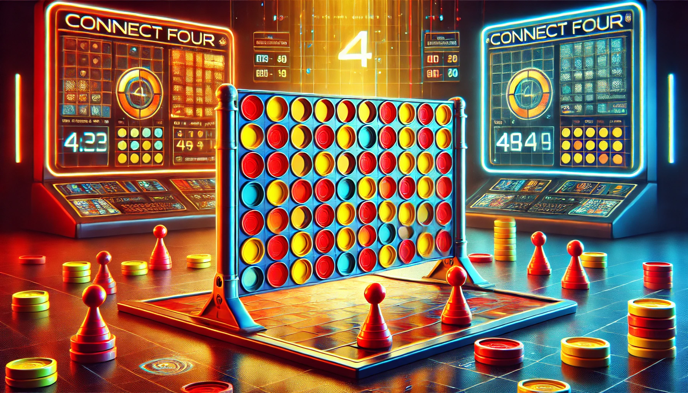

# Connect 4 Game with Scoring



This project is a Java-based implementation of the classic Connect 4 game with a modern twist. The game allows a user to compete against the computer, adding a scoring system to make gameplay more competitive and fun.

## Features

- **Interactive Gameplay:**
  - Play against the computer in a 6x7 grid.
  - Choose columns to drop your piece.

- **Scoring System:**
  - Earn points for every sequence of four consecutive pieces (horizontal, vertical, or diagonal).
  - The game tracks scores for both the user and the computer.

- **Dynamic Updates:**
  - The game board is updated and displayed after every move.
  - Handles invalid inputs and prevents overwriting filled cells.

- **End-of-Game Results:**
  - The game ends when the board is full.
  - Final scores are displayed, and the winner is announced.

## How to Play

1. **User Turn:**
   - You will be prompted to choose a column (1-7) to drop your piece (`X`).
   - If the selected column is full, you'll be asked to select another.

2. **Computer Turn:**
   - The computer selects a random column to drop its piece (`O`).
   - Ensures valid moves by avoiding full columns.

3. **Game Progression:**
   - The game alternates turns between the user and the computer.
   - The board updates dynamically after each move.

4. **Scoring:**
   - Points are awarded for every sequence of four consecutive pieces (horizontal, vertical, or diagonal).
   - Both the user and the computer's scores are calculated at the end of the game.

5. **Game End:**
   - The game ends when the board is completely filled.
   - Final scores and the winner are displayed.

## Example Gameplay

### Starting the Game
```
- - - - - - - 
- - - - - - - 
- - - - - - - 
- - - - - - - 
- - - - - - - 
- - - - - - - 
Please select a column between 1 to 7:
```

### Mid-Game Board
```
- - - - - - - 
- - - - - - - 
- - - - - - - 
- - - O - - - 
- - X X - - - 
- O X X O - - 
```

### End-of-Game Result
```
The game is over!
User Score: 2
Computer Score: 1
You won!!
```

## Code Structure

- **`main`:** Entry point of the application; initializes the game loop.
- **`game`:** Manages the game logic and alternates turns between the user and computer.
- **`showboard`:** Displays the current state of the board.
- **`userTaw` and `computerTaw`:** Handle moves for the user and computer, respectively.
- **`checkScore`:** Calculates scores based on sequences of four consecutive pieces.
- **`isBoardFull`:** Checks if the board is completely filled.
- **`endGame`:** Displays the final results and announces the winner.
- **`getInputNum`:** Validates user input for column selection.

## Requirements

- **Java Development Kit (JDK)** version 8 or higher.
- A terminal or IDE to run the program.

## How to Run

1. Compile the program using the `javac` command:
   ```
   javac App.java
   ```

2. Run the program:
   ```
   java App
   ```

Enjoy playing Connect 4 with a scoring twist!
